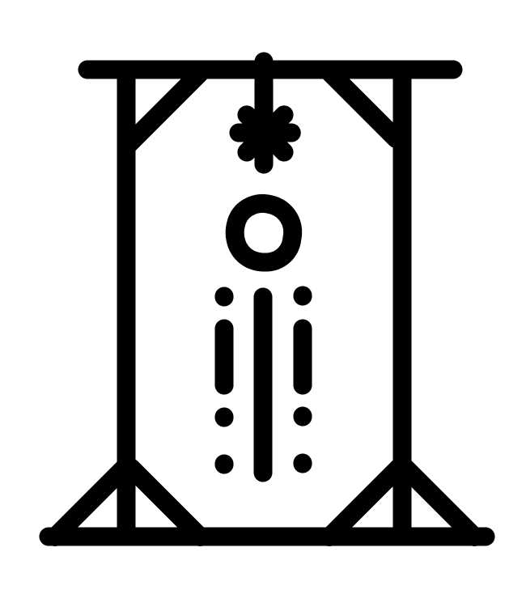

# CLI-Hangman

<div align="center">
    
</div>

<br>

<div align="center">
    
    <a href="https://wakatime.com/badge/user/a61b2181-3d29-486a-b232-a3254a04695d/project/4afed962-5e0a-410d-a845-e62c38f67430"></a>
  </a>
</div>

<br>

<div align="center">
    
    
    
</div>

## File hierarchy

```sh
├── cmd
│  └── hangman
│     └── main.go
├── go.mod
├── go.sum
├── imgs
│  └── logo.png
├── internal
│  ├── application
│  │  ├── errors.go
│  │  ├── game_service.go
│  │  └── word_selector.go
│  ├── domain
│  │  ├── errors.go
│  │  ├── game.go
│  │  └── word.go
│  └── infrastructure
│     ├── errors.go
│     ├── input.go
│     ├── output.go
│     └── word_loader.go
├── Makefile
├── pkg
│  └── utils
│     ├── clear_screen.go
│     └── json_loader.go
├── README.md
├── tests
│  ├── application
│  │  └── application_test.go
│  ├── domain
│  │  └── domain_test.go
│  └── infrastructure
│     └── infrastructure_test.go
└── words.json
```

## Description of the file hierarchy

- **`cmd`** - directory containing the application's executable files. This is where the `hangman` executable is located, which runs the application. The `main.go` file creates a game service and starts the game process by calling the `StartGame` method
- **`internal`** - directory containing internal packages that are used only within this project:
    - **`application`** - — a package responsible for the main logic and use cases of the application:
        - *`errors.go`* - contains custom errors for handling exceptions in the application
        - *`game_service.go`* - contains logic for working with the game, including loading words, selecting words by difficulty, starting a game session and managing the game loop
        - *`word_selector.go`* - contains the logic for selecting a word depending on the selected difficulty
    - **`domain`** - package containing the models:
        - *`errors.go`* - contains custom errors associated with objects, for example errors when retrieving game properties or words
        - *`game.go`* - describes the nature of the game and controls the state of the game, such as ongoing attempts, guessed letters and game completion
        - *`word.go`* - represents the word to be guessed and its metadata, including the hint
    - **`infrastructure`** - package responsible for infrastructure components, such as input/output, loading from files:
        - *`errors.go`* - contains errors related to infrastructure components, such as errors in data entry and loading
        - *`input.go`* - processes user input, including language selection, difficulty and number of attempts
        - *`output.go`* - Responsible for displaying information in the console, such as the current word state, available letters, and a graphical display of the gallows
        - *`word_loader.go`* - parses words from the JSON file words.json
    - **`pkg`** - a directory containing packages that can be reused in other projects:
        - *`utils`* — package with utilitarian functions:
            - *`clear_screen.go`* - function to clear the console screen
            - *`json_loader.go`* - function for reading JSON files
    - **`imgs`** - directory containing images for the README
    - **`Makefile`** - a file for automating the build and testing of the project
    - **`words.json`** - JSON file with words and hints in several languages, used for the game

## JSON word file format

The JSON file must contain two keys:
- **`en-words`** for english words
- **`ru-words`** for russian words

<br>

The value is an array containing two fields:
- **`word`** — the word itself that needs to be guessed
- **`hint`** - a hint that will make the player’s task easier

***Example of JSON file with words:***
```JSON
{
  "en-words": [
    {"word": "lime", "hint": "green citrus fruit used in cocktails and cooking"},
    {"word": "lemon", "hint": "yellow citrus fruit used in cocktails and cooking"},
    {"word": "tangerine", "hint": "orange small citrus fruit"}
  ],

  "ru-words": [
    {"word": "лайм", "hint": "зеленый цитрусовый фрукт используемый в коктейлях и кулинарии"},
    {"word": "лимон", "hint": "желтый цитрусовый фрукт используемый в коктейлях и кулинарии"},
    {"word": "мандарин", "hint": "оранжевый маленький цитрусовый фрукт"}
  ]
}
```

## Testing project logic

1. **Checking custom errors:**

   Tests check the correct handling of errors that occur during the operation of the application

2. **Checking word choice by language and difficulty:**

   Tests check that the words are chosen correctly depending on the game parameters

3. **Gameplay check**:

   Tests check the correct operation of the game logic

4. **Checking data loading**:

   Tests check the correctness of loading words from JSON files

## Rules of the game

1. **Available languages** - Russian and English
2. **Available difficulties** - easy, medium and hard
3. **Maximum attempts** - the number of attempts must be in the range from 1 to 99
4. **Input** - only enter one letter at a time
5. **Incorrect input** - if an incorrect letter is entered, 1 attempt is lost
6. **Hints** - if less than 20% of attempts remain, a hint will be offered

## Example of working

[Example of working](https://vimeo.com/1010568935)

## Usage:
1) Build the project:
```shell
make build
```

2) Run the project with cli-arguments:
```shell
./bin/hangman --jsonPath="words.json"
```
